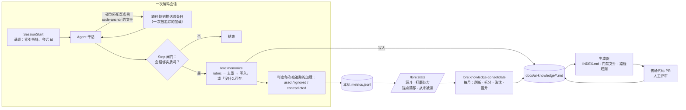

# lore

[English](README.md) | 简体中文

给 AI 编程 agent 用的知识库引擎：每次有实质产出的编码会话结束后，自动把「代码推不出来的事实」沉淀进仓库——下次涉及相关代码时按需读回。

- **内容住在各个仓库里**（`docs/ai-knowledge/`）——纯 markdown、runtime 无关，随普通代码 PR 走人工评审
- **引擎是本插件**（skills + hooks + 生成器）——按人安装一次，所有已接入的仓库生效
- **度量闭环**——被追踪的每次知识加载都会在会话收尾被回判 used / ignored / contradicted，过期和无用的知识靠数据发现，而不是靠感觉

## 为什么不直接用 CLAUDE.md / agent 记忆 / RAG？

| | lore |
|---|---|
| CLAUDE.md | CLAUDE.md 每个会话整体加载，必须保持短小通用。lore 的知识条目**按需加载**（索引一行 + 触碰锚定代码时的路径推送），知识库可以持续增长而不给每个会话加税。lore 的沉淀 rubric 明确拒收 CLAUDE.md 已覆盖的内容。 |
| 按用户的 agent 记忆 | 个人记忆队友看不到，账号没了它也没了。lore 的知识是**仓库里的文件，经过人工 PR 评审**，所有 agent 和所有人共享。 |
| 文档 RAG | RAG 只负责检索，没人告诉你检索到的东西*有没有帮上忙*。lore 度量整条漏斗——沉淀 → 加载 → used/ignored/contradicted——并配套消费这些度量的治理流程（`knowledge-consolidate`）。 |

这里的「知识」指什么：**代码推不出来的事实**——隐式业务规则、跨仓约定、带原因的坑、反知识（"模型总以为是 X，实际是 Y"）。代码结构、schema、任务状态会被沉淀 rubric 明确拒收。

## 运行方式



1. **接入一次。** `/lore:init` 创建 `docs/ai-knowledge/`。这个目录的存在就是 opt-in 标记：每个 hook 先检查它，其他仓库里什么都不做。
2. **按需检索。** `INDEX.md` 每条只占一行。agent 碰到匹配某条目 `code-anchors` 的文件时，路径规则把该条目推进上下文，每次推送都是一次被追踪的加载。
3. **收尾时沉淀。** Stop 闸门只对实质性会话触发。`lore:memorize` 过 rubric、对索引去重，最多写一两个文件，或者报告「没什么可存」，这同样是正当结果。
4. **判定读过的内容。** 同一次收尾把每次被追踪的加载标为 used、ignored 或 contradicted。下游的一切都靠这个信号运转。
5. **像代码一样评审。** 生成器重建索引、门禁文件和规则；知识和生成物随普通 PR 走，CI 的 `--check` 兜住漂移。
6. **每月治理。** `/lore:stats` 把度量变成处方、锚点漂移和淘汰候选；`lore:knowledge-consolidate` 据此行动，并把跨仓事实晋升到团队记忆层。

## 设计原则

- **知识跟着代码走。** 条目放在「哪个仓的代码变了它就失效」的那个仓里，锚定到具体文件。锚点既是检索触发器，也是漂移探测器。
- **只存代码推不出来的事实。** rubric 拒收代码结构、schema、任务状态和 CLAUDE.md 已经写了的内容。「没什么可存」是一等结果。
- **知识是线索，不是事实源。** agent 在关键决策前按锚点回代码核实；两者冲突时代码为准，顺手修条目。
- **像代码一样评审。** 纯 markdown 走普通 PR。生成物只重建、不手改；写入门禁只放行 skill，没有 agent 能悄悄污染知识库。
- **按需检索，而非默认加载。** 每条只占索引一行，碰到锚定代码才推送。库可以增长而不拖累每个会话，超过阈值索引自动分组。
- **可度量的闭环。** 每次加载都在收尾时被判定；stats 把判定变成处方、漂移和淘汰候选，consolidate 每月消费。度量留在本机，除非团队显式开启共享。
- **Opt-in 且与运行时无关。** 没有 `docs/ai-knowledge/` 的仓库里 hook 什么都不做。内容是任何 agent 都能读的普通文件，Claude Code 与 Codex 共用同一套引擎脚本。

## 快速开始

```
/plugin marketplace add notverysalty/lore-plugin
/plugin install lore@lore-plugin
```

然后在你关心的仓库里：

1. `/lore:init` —— 创建 `docs/ai-knowledge/` 骨架、CLAUDE.md/AGENTS.md 指针，并引导你 seeding 首批真实知识（别跳过 seeding——空知识库让自动化无事可做）。已有 ADR、事故复盘、runbook？`/lore:harvest` 可以批量收割（逐条确认后写入）——这是跨过冷启动最快的路。
2. 正常干活。会话有实质产出时，Stop 闸门会让 agent 评估是否有值得沉淀的内容（回答「无沉淀」是合法且被鼓励的结果）。
3. 编辑被知识锚点覆盖的代码时，对应知识条目会自动推送进上下文。
4. `/lore:stats` —— 健康报告：沉淀转化漏斗、命中率、打磨候选、矛盾追踪。
5. 大约每月一次：`/lore:knowledge-consolidate` —— 数据驱动的治理（去重、修过期条目、打磨低命中条目、归档死条目）。

## 组成

| 部件 | 作用 |
|---|---|
| skill `lore:init` | 仓库一键接入：骨架 + 指针 + settings + seeding |
| skill `lore:memorize` | 沉淀：rubric 判定 → 查重 → scope 路由 → 落盘 → 重建索引 |
| skill `lore:knowledge-consolidate` | 治理：去重/解矛盾、打磨低命中条目、收割 pending、归档 |
| skill `lore:resolve-merge` | 知识文件的 git 合并冲突：语义并集合并——绝不丢条目 |
| skill `lore:set-language` | 仓级知识语言（`docs/ai-knowledge/lore.json`），可选翻译存量条目 |
| skill `lore:harvest` | 批量导入：从存量文档（ADR、事故复盘、runbook、粘贴文本）挖掘代码推不出来的事实；写入前逐条确认 |
| command `/lore:doctor` | 自检：依赖、hook 注册、各通道活性、闸门干跑、当前仓 `--check` 与索引规模——所有 hook 都 fail-open，坏了是静默的，这个命令让它可见 |
| hook `SessionStart` | 记录会话起始 HEAD（「累计改动」的基线） |
| hook `Stop` | 双层闸门第一层：只有实质工作量的会话才触发沉淀评估；同时收集本会话已加载知识的 used/ignored/contradicted 回判 |
| hook `PreToolUse` + `PostToolUse` | 写入门禁：只有 lore skill 的指令在上下文里时知识文件才可写（hook 发放的限次授权）；生成物一律禁止手改 |
| hook `InstructionsLoaded` | 异步埋点：记录知识文件被加载（读取率度量） |
| `scripts/lore-stats.sh`（`/lore:stats`，支持 `--since=YYYY-MM-DD`） | 沉淀转化漏斗 / 读取有效性与 14 天趋势 / 打磨候选**（每条附修复处方）** / 矛盾追踪 / 团队汇总 / **锚点演进**（锚定代码在知识写后又改过）/ 库存（pending 堆积、从未被读、time-to-first-use）；`export-summary` 仅在仓库开启 `teamMetrics` 后把你的个人团队汇总写进仓库 |
| `scripts/gen-knowledge-index.mjs` | 从 frontmatter 生成 INDEX.md（平铺；仓库长大后按代码区域分组）+ `.claude/rules/knowledge/*.md` + 写入门禁文件；校验 frontmatter 并 lint 写入时的坏味道（宽句 description、目录锚、超长文件——`--strict` 升级为错误）；写模式带并发锁；`--check` 供 CI |

## 行为边界（opt-in 设计）

每个 hook 第一步都检查当前仓库是否存在 `docs/ai-knowledge/`：**没有就静默退出**。插件全局启用，但只在接入了知识库的仓库里*做事*；其他项目零感知。

Stop 闸门只在真的干了活时才出声（任一条件即静默：防循环标记、subagent 内、未接入、自会话起始累计改动 < 10 行且真实用户轮次 < 8、本会话已评估 2 次、改动指纹与上次评估相同、任何脚本错误）。

## 规模化：平铺索引 vs 分组索引

INDEX.md 每个会话整体加载，平铺列表迟早会重新长成 lore 本来要避免的「CLAUDE.md 太大」问题。超过阈值（默认 30 条）后生成器把索引切换为**分组模式**：按锚定的代码区域（条目首个锚点的前两级路径）分节，description 截短——description 的开头就是症状关键词，完整触发词表在文件的 frontmatter 里。路径推送 rules 不受影响。通过 `docs/ai-knowledge/lore.json` 调节：`"indexMode": "flat" | "grouped" | "auto"` 与 `"indexGroupThreshold": 30`。接近阈值时 `/lore:doctor` 会提醒。

## 知识语言

引擎文案、生成物、frontmatter 恒为英文。知识*正文*的语言按仓配置：`docs/ai-knowledge/lore.json` → `{"language": "zh-CN"}`（init 时设置，或之后用 `/lore:set-language` 切换——它还能顺带翻译存量条目）。报错串、标识符、代码片段永远不翻译——它们是精确匹配的检索键。

## 写入门禁（读开放，写走引擎）

`docs/ai-knowledge/` 对所有 runtime 开放读取。写入必须经由 lore 流程（memorize / consolidate / resolve-merge / init / set-language）。生成器在每个接入仓的知识目录里产出 `AGENTS.md` / `CLAUDE.md` 门禁文件（本身是生成物，`--check` 校验防漂移）：没装 lore 的 agent 会被告知把候选知识写进 PR 描述，仅保留信任协议的最小订正。装有 lore 的 Claude Code 会话由 hook 强制执行：知识文件需要 hook 发放的限次授权（不存在可手动执行的授权命令）；生成物无条件拒绝。诚实边界：经 Bash 的写入会绕过任何 hook——仓侧 CI（`ci/knowledge-check.yml`）是谁都绕不过的一层，因为谁都绕不过 PR。

## CI（建议每个接入仓配置）

```yaml
- run: node <plugin-or-vendored-path>/gen-knowledge-index.mjs . --check
```

校验：frontmatter 合法（kebab-case 唯一 name、枚举、日期、`lore.json`）、锚点存活、生成物零漂移、`.gitattributes` union 条目齐全；并对让知识被无视的写入坏味道（宽句 description、目录锚、超长文件）打印 **lint 提示**——加 `--strict` 可把提示升级为失败。触发路径必须包含 `docs/ai-knowledge/**`、`.claude/rules/knowledge/**` **和** `.gitattributes`（模板见 [ci/knowledge-check.yml](ci/knowledge-check.yml)——少了最后一条，只删 union 行的 PR 就绕过了校验）。

## 并发治理

- **同机多会话**：生成器写模式带目录锁（`docs/ai-knowledge/.gen-lock`，残留超 60 秒自动接管），并发 memorize/init 的写盘串行化。
- **多人 git 合并**：接入仓给**生成物**设 `merge=union`（冲突自动拼接，残留由重跑生成器收敛，CI `--check` 兜底）；知识源文件保持默认冲突行为，交给 `lore:resolve-merge` 做语义合并。union 条目本身由生成器逐行维护、自动补齐。
- **共享文件**（gotchas/contract）：memorize 用精确 Edit 追加、禁全文重写，并行会话不会互相覆盖。

## 日常使用

日常零动作：正常写代码，触碰锚定路径时相关知识自动推送；有实质产出的会话收尾时自动评估沉淀。仅有的手动动作：`/lore:memorize`（立刻沉淀）、直接向 agent 提问（查约定）、告诉 agent「这条知识过期了」（信任协议订正）。

PR 里评审知识文件的三问：事实对不对？有没有 code-anchors？是不是代码推不出来的？（推得出 → 拒。）

## 度量与隐私

所有原始度量**只存本机、零上报**：事件（闸门触发、加载、回判、写入）追加到本机的 `~/.claude/plugins/data/lore/metrics.jsonl`（Codex 为 `~/.codex/lore-data/metrics.jsonl`）——仅含仓名、知识文件名、session id；从不含文件内容。不向任何地方上传。`/lore:stats` 读这些文件。覆盖率说明：加载事件取决于 runtime 暴露的观测点（Claude Code：索引/rules 加载；Codex：路径推送命中），回判只在触发 Stop 闸门的实质会话中收集。

### 可选：团队汇总（默认关闭）

除非仓库显式开启，不会有任何内容共享给团队。在 `docs/ai-knowledge/lore.json` 里设置 `"teamMetrics": true` 之后，memorize 与 knowledge-consolidate 才会同时刷新 `docs/ai-knowledge/.metrics/<user>.json`，随知识所在的 PR 一起提交。

- **文件包含什么**：你的 git 用户名（或 `LORE_METRICS_USER`）、最近 90 天每个知识文件的 loads / used / ignored / contradicted / written 计数、闸门触发次数、导出日期。不含 session id，不含时间线，不含知识内容。
- **用来做什么**：`/lore:stats` 把所有已提交的汇总聚合成团队段（最常用条目、全员忽略的条目），并且只要任一队友的汇总显示过读取，就不再把该条目报成「从未被读」。
- **关闭时（默认）**：`export-summary` 不写任何文件并明确提示。开启前请团队一起决定，公开仓库里的汇总同样是公开的。
- 汇总文件是生成物：标记 `linguist-generated`，写入门禁拒绝手改，由每次导出重建。
### 跨仓知识与团队记忆层

lore 是**代码锚定**的那一层：知识归属某个仓、随它的 PR 走、在你触碰它描述的代码时被推送。跨仓事实（`scope: cross-repo`、`promote: pending`）不该在这里堆积——它们属于团队记忆层（Hindsight / Mem0 这类经 MCP 暴露的记忆库、共享知识仓、wiki 空间）。在 `lore.json` 用 `"promotionTarget"` 指明这一层，`knowledge-consolidate` 就会把 pending 条目以紧凑的持久事实上行到那里，仓内文件保留为锚定细节。两层是互补而非竞争：记忆系统在 *agent 主动问* 的时候回答；lore 在 *agent 触碰代码* 的时候回答。

## 跨 runtime（Codex）

内容层（`docs/ai-knowledge/` + `AGENTS.md` 指针）runtime 无关——任何 agent 都能读。引擎层目前支持两个 runtime：

- **Claude Code**：本插件——skills + hooks + 原生路径推送 rules；完整体验。
- **Codex**：`bash codex/install.sh`——同一套 skills（以 `lore-*` 名装进 `~/.agents/skills`）、codex 模式的同一套闸门脚本、复用 rules 生成物的 PostToolUse 路径推送。对齐 codex-cli 0.144.x 文档；该接口迭代快，新版 CLI 上有异常请开 issue。详见 [codex/README.md](codex/README.md)。

一个 runtime 一条通道，别双装。没装引擎的 runtime 对知识库只读，由生成的门禁文件约束。

## 排障

lore 的每个 hook 都是 fail-open 设计——坏掉的 hook 绝不能砸掉会话——代价是通道坏了没有任何声音。`/lore:doctor` 让它可见：依赖与目录布局检查、hook 注册、数据目录可写性、各通道从你的度量里推出的活性、在隔离数据目录里对写入门禁 / Stop 闸门 / 路径推送做干跑，以及当前仓的 `--check` 与索引规模状态。装完、升级 Claude Code 后、或 `/lore:stats` 里某个通道归零时跑一下。

## 环境要求

- macOS 或 Linux（bash 3.2+；Windows 走 WSL）
- `jq`、`git`、Node.js ≥ 18
- 多仓特性（跨仓锚点、跨仓沉淀路由）假设兄弟仓 checkout 在同一父目录下
- 验证基线：Claude Code（2026-08）与 codex-cli 0.144.x 文档。两个接口都迭代很快（斜杠命令/skill 解析和 `${CLAUDE_PLUGIN_ROOT}` 行为已在版本间变化过）——新版本上有异常请开 issue。

## 许可证

[MIT](LICENSE)
